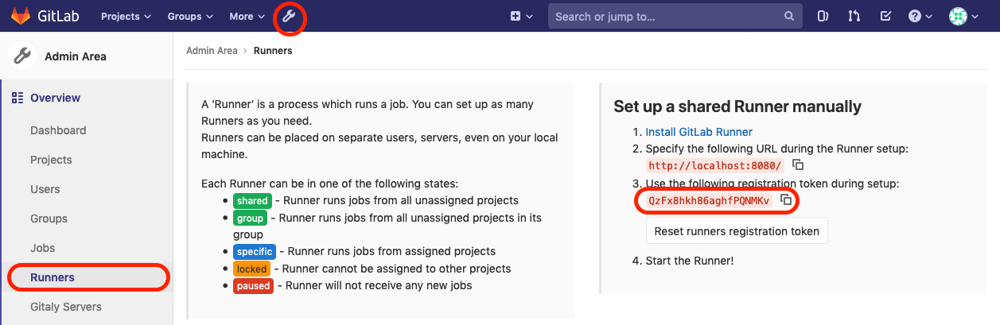

# Gitlab-Lab
Gitlab-lab is docker-compose for running complete gitlab and gitlab ci. The main purpose is to simulate gitlab on development computer, so engineer free to do anything without fear of crashing production server.

## Requirements
1. Docker
2. Docker compose
3. Internet connection
4. TCP Port 2222, 8080, 4567, 8443 (or change by yourself in the docker-compose.yml)

## Setup

```
## setup gitlab
git clone --depth=1 https://github.com/mahirrudin/gitlab-lab
cd gitlab-lab
docker-compose up -d
```
```
## check if gitlab running
docker-compose ps
```
```
        Name                       Command                  State                                   Ports
-------------------------------------------------------------------------------------------------------------------------------------
gitlab.devsecops.lab    /assets/wrapper                  Up (healthy)   0.0.0.0:2222->22/tcp, 443/tcp, 0.0.0.0:4567->4567/tcp, 80/tcp
runner.devsecops.lab    /usr/bin/dumb-init /entryp ...   Up
traefik.devsecops.lab   /entrypoint.sh --log.level ...   Up             0.0.0.0:80->80/tcp, 0.0.0.0:8080->8080/tcp
```
Since domain `gitlab.devsecops.lab` is not valid, you must add this on hosts file. 

```
# For Windows -> C:\Windows\System32\drivers\etc\hosts
# For Linux/Mac -> /etc/hosts
127.0.0.10	gitlab.devsecops.lab
```
Access via browser http://gitlab.devsecops.lab, login with `root` and set for the password. Then copy runner token.



Execute the script for registering runner, and put gitlab runner token.

```
# for linux
script/runner-register.sh

# for windows
script/runner-register.bat
```

